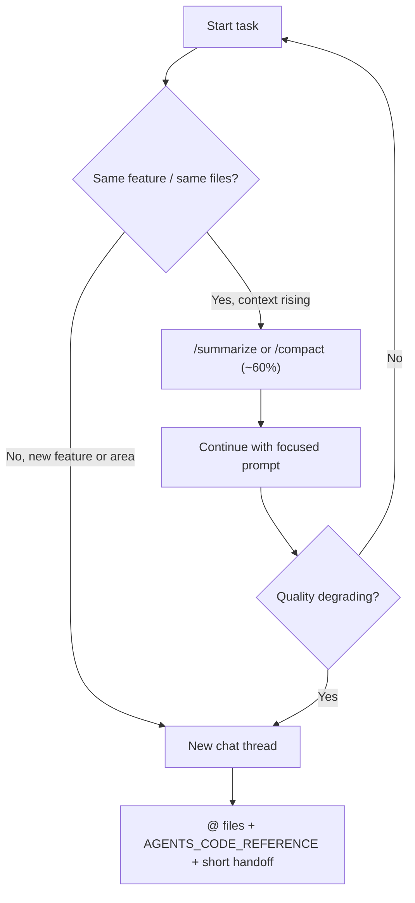

## Compact context and new chat threads — IDE comparison

Long agent sessions accumulate **messages, tool output, and file reads** in the model context. As the window fills, quality often drops: the model repeats work, forgets constraints, or hallucinates. **Compact** (compress/summarize the *chat*) and **new threads** (fresh context) are how you keep the assistant focused on what still matters.

This is separate from—but complementary to—[[Large Context in 2026 - Prefer Code at Hand Over Describing Libraries]] (having real code available) and [[_Context - Ever-updating High-Level Context that Optimizes Token Usage and Lowers Likelihood of Lines disappearing]] (repo maps).

---

## Two kinds of “compact”

| Kind | What it affects | Who it helps most |
| --- | --- | --- |
| **Chat compact / summarize** | Shrinks *conversation history* in the agent window | **The AI** — frees tokens, keeps a lossy summary of prior turns |
| **Editor folding** | Collapses code *regions* in the editor UI | **You** — less visual noise while reading |

**Editor folding** (VS Code, Cursor, JetBrains, etc.) does not automatically remove lines from the model’s context unless you **@-mention** a smaller selection. Use folding to stay oriented; use **@file / @folder / @symbol** to send only the slice the task needs.

**Chat compact** directly changes what the model “remembers” from earlier in the session.

---

## Why a “clearer picture” matters for AI assistants

What fills context besides your latest prompt:
- Every prior user message and assistant reply
- Every **read file**, **grep**, **terminal** output, and tool trace
- System rules, skills, and attached docs

As usage approaches the limit:
- Models tend to **attend to recent tokens**; early decisions and file paths fall off or get summarized away.
- **Summarization is lossy** — exact diffs, error strings, and “why we chose X” may disappear.
- One mega-thread mixing **auth refactor + CSS + dependency bump** blurs focus; the model treats everything as equally “current.”

**Compact** trades detail for continuity inside the *same* thread. **New chat** trades continuity for a **clean, task-scoped** window. Both beat letting context sit at 95% with degraded behavior.

---

## Which IDEs / tools offer chat compact?

| Product | Manual compact / summarize | Auto when full | Fresh thread | Notes |
| --- | --- | --- | --- | --- |
| **Cursor** | `/summarize` (slash command; availability varies by version) | Yes — “Chat context summarized” / background summarization of older turns | New Agent chat (`Cmd+L` / chat panel **+**) | Community also requested `/compact`; Cursor docs/forums refer to **`/summarize`**, not `/compact`. |
| **Claude Code** | **`/compact`** optional focus text, e.g. `/compact Keep auth refactor decisions` | Auto-compact near limit | **`/clear`** or new session; **`/resume`** for old threads | Also **`/context`** to inspect usage; **`/clear`** = empty slate (not summarize). |
| **Windsurf (Cascade)** | No direct `/compact` equivalent documented | Retrieval + pinning; long threads rely on indexing/Memories | New Cascade / chat thread | Emphasis on **@-mentions**, **pinned context**, **.windsurfrules** rather than explicit compress command. |
| **GitHub Copilot Chat** | Session-based; limited explicit “compact” | New chat session per topic | VS Code / JetBrains new chat | Treat as **short, scoped** sessions. |
| **Cline / OpenCode / terminal agents** | Varies by wrapper; often **you** summarize or restart | Depends on host | New task / new terminal session | Same principles: don’t carry one thread across unrelated epics. |

**Naming:** If someone says “use `/compact`,” they often mean **Claude Code**. In **Cursor**, try **`/summarize`** first (or let auto-summarization run).

---

## Cursor (Agent chat)

**Manual:** Type `/summarize` in the agent input when context is high (~50–70% on the usage indicator) or after finishing a sub-task.

**Automatic:** Cursor summarizes older messages when the thread nears the model window (UI may show “summarizing context”). You keep a high-level thread of what happened, not every tool payload verbatim.

**Editor:** Standard VS Code folding (`Fold All`, region folding) — organizational only unless you narrow what you @-attach.

**When summarize helps:** Same feature, many iterations, you want one thread ID and rough memory of prior steps.

**When summarize hurts:** You still need exact earlier tool output, line numbers from turn 12, or a clean separation between unrelated tasks — prefer **new chat** (below).

---

## Claude Code

| Command | Effect |
| --- | --- |
| **`/compact [instructions]`** | Summarize conversation so far; optional focus (“preserve DB migration plan”). |
| **`/clear`** | Wipe context; prior thread may remain in **`/resume`**. |
| **`/context`** | Show what is consuming the window. |

Proactive **`/compact` around ~60%** usage is a common habit before starting the next sub-task within the same session.

Partial compact: **Esc + Esc** → rewind to a checkpoint → “Summarize from here” (keeps early messages full, compresses later noise).

---

## New chat thread is often better than endless compact

Cursor’s team and many power users **start a new Agent chat** when:

- You move to a **different feature, folder, or layer** (API → UI → infra).
- The previous task is **done** (merged, committed, or parked).
- You see **repeated mistakes**, re-reads of the same files, or “forgetting” constraints from 20 turns ago.
- **Summarization already ran** more than once in the same thread (compounding loss).

### What you gain with a new thread

| Benefit | Why |
| --- | --- |
| **Task-scoped context** | Only files and rules relevant to *this* prompt get pulled in. |
| **No stacked summaries** | Each `/summarize` or auto-summary drops detail; fresh chat avoids “summary of a summary.” |
| **Clearer instructions** | New system turn; old tangents (debugging yarn, unrelated PR) are not in window. |
| **Better tool use** | Agent re-reads current files instead of trusting stale summarized file contents. |

### What you lose — and how to recover it

A new chat does **not** remember prior turns unless you bring context back deliberately:

1. **@-mention** the files, folders, or symbols for *this* task only.
2. **Point at persistent docs:** `AGENTS.md`, `AGENTS_CODE_REFERENCE.md`, [[_Context - Ever-updating High-Level Context that Optimizes Token Usage and Lowers Likelihood of Lines disappearing]].
3. **Cursor:** In a new chat, reference or paste a short handoff (“Continue auth refactor in `src/auth/`; JWT middleware done; next: refresh tokens”).
4. **Claude Code:** **`/resume`** an old conversation if you truly need that thread; otherwise **`/compact` once** then continue, or **`/clear`** + concise spec.
5. **Commit or note decisions** in the repo so the model reads truth from disk, not from chat memory.

**Rule of thumb:** **New chat per task or per area of codebase.** **Compact within a task** when you are mid-flow and cannot afford to re-explain—but compact **before** quality collapses, not only at 100%.

---

## Practical workflow (Cursor-focused)

1. **One chat = one objective** (e.g. “add rate limit to login API”).
2. Watch context usage; at **~50–70%**, run **`/summarize`** *or* end the sub-task.
3. **New Agent chat** for the next objective; @ only what matters.
4. Keep [[_Context - Ever-updating High-Level Context that Optimizes Token Usage and Lowers Likelihood of Lines disappearing]] updated so new chats do not need a novel-length recap.
5. Use editor **folding** while *you* review; use **@** while *the agent* works.

---

## Related

- [[Large Context in 2026 - Prefer Code at Hand Over Describing Libraries]]
- [[Giving More Code Access to AI - Cursor, opensrc, and bash-tool]]
- [[Service Layer - code-structure Skill (Michael Shimeles)]]
- [[_PRIMER - Accurate Code Generation Context Management (Shortcut)]]
