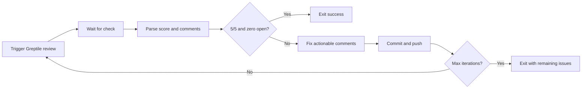

# Greptile code review and `/greploop`

[Greptile](https://www.greptile.com/) is an AI **pull request code review** service. It comments on PRs, posts inline findings, and assigns a **confidence score** so you can see merge-readiness at a glance.

Docs: https://www.greptile.com/docs/code-review/first-pr-review

---

## Confidence score (0–5)

Greptile adds a **0–5 confidence** rating on each review. It reflects issue severity and count, change complexity, and fit with your codebase patterns (via `greptile.json` and custom context).

| Score | Meaning | Typical action |
| --- | --- | --- |
| **5/5** | Production ready | Merge |
| **4/5** | Minor polish | Small fixes, then merge |
| **3/5** | Implementation issues | Address feedback first |
| **2/5** | Significant bugs | Rework |
| **0–1/5** | Critical problems | Major rethink |

Scores are **contextual**: 3/5 on payments is more serious than 3/5 on an internal script.

Configure visibility in repo `greptile.json` (`includeConfidenceScore`, `confidenceScoreSection`, etc.).

---

## What you get on a PR

Besides the score, reviews can include:

- PR summary
- Inline comments with suggested fixes
- Issues table
- Optional sequence / ER / class / flow diagrams (auto-selected from change type)

Greptile runs as a **GitHub check** on PRs where it is installed.

---

## `/greploop` — generate, review, fix, repeat until 5/5

`/greploop` is a **Claude Code agent skill** from Greptile that automates the fix–review cycle until the PR reaches **5/5 confidence** with **no unresolved Greptile comments**.

- Skills repo: https://github.com/greptileai/skills  
- Docs: https://www.greptile.com/docs/mcp-v2/skills  

### Prerequisites

- Claude Code installed
- `git` and `gh` authenticated
- Greptile installed on the repository
- [Greptile MCP server](https://www.greptile.com/docs/integrations/claude-code) configured in Claude Code

### Install skills

```bash
git clone https://github.com/greptileai/skills.git ~/.claude/skills/greptile
```

### Usage

```
/greploop
```

Or for a specific PR:

```
/greploop 42
```

### Loop behavior



1. **Trigger review** — push and wait for the Greptile review check.
2. **Parse results** — read confidence (e.g. `3/5`) and unresolved inline comments.
3. **Fix** — apply code changes for actionable items; note false positives / informational items.
4. **Commit, push, repeat** — up to **5 iterations** (safety cap).
5. **Exit** — when score is **5/5** and unresolved count is **0**, or when iteration limit is hit.

Example success output:

```text
Greploop complete.
  Iterations:    2
  Confidence:    5/5
  Resolved:      7 comments
  Remaining:     0
```

### Related skill: `/check-pr`

`/check-pr` waits for CI and bot checks, categorizes issues (actionable / informational / already addressed), fixes actionable items, and resolves threads—without necessarily targeting 5/5 in a loop.

Use **greploop** when the goal is explicitly **Greptile score convergence**; use **check-pr** for a broader “clean up this PR” pass.

---

## Pairing with “code at hand” workflows

Greptile reviews **diffs** against your repo patterns. Your local agent (Cursor, Claude Code + greploop) still benefits from [[Large Context in 2026 - Prefer Code at Hand Over Describing Libraries]], [[Giving More Code Access to AI - Cursor, opensrc, and bash-tool]], and [[Service Layer - code-structure Skill (Michael Shimeles)]] when *implementing* fixes—especially when comments point at library misuse, duplicated helpers, or missing edge cases.

---

## Related

- [[_PRIMER - Code Context and Review Tools (Shortcut)]]
- [[Large Context in 2026 - Prefer Code at Hand Over Describing Libraries]]
