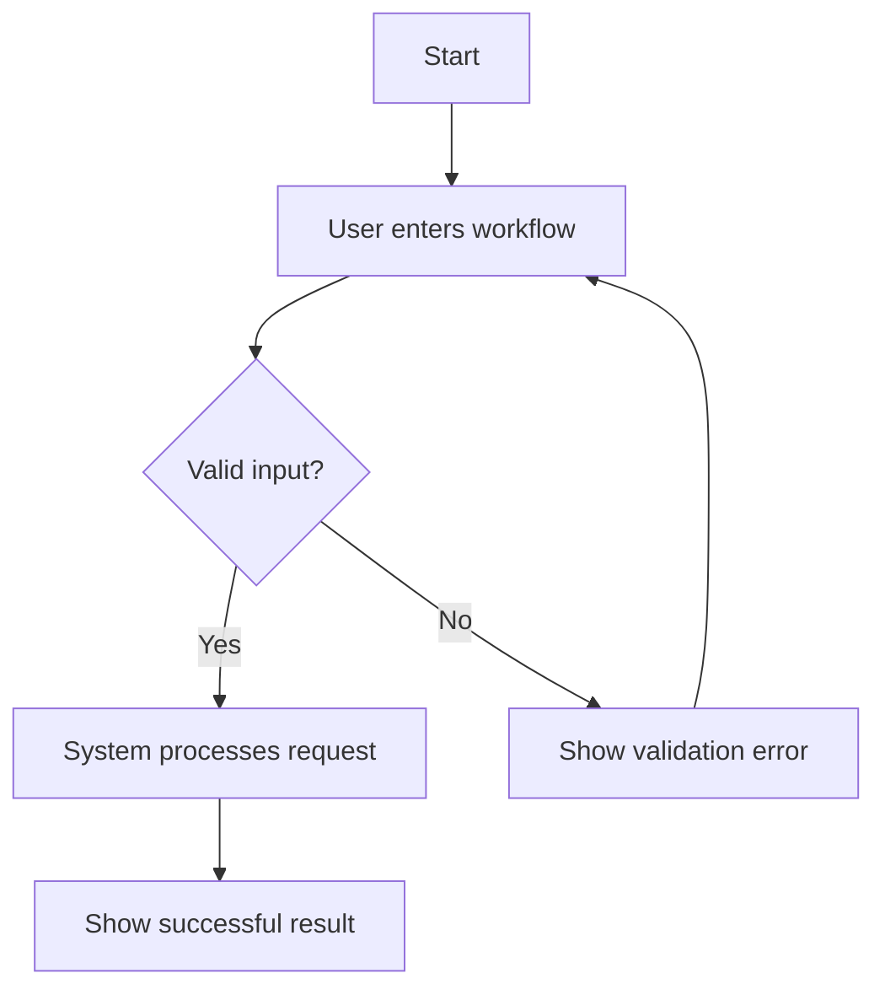

Use this prompt with an agentic coding model when you need to orient a project manager, product manager, executive, designer, or stakeholder to an existing application.

```prompt
You are an experienced product strategist, UX researcher, and software architect.

Your task is to reverse-engineer the existing application and produce a grounded market-and-user orientation for a project manager or stakeholder.

The goal is not to redesign the app or recommend a new product. The goal is to explain what this application appears to do today, who it serves, what problem it solves, how it compares with alternatives, and how real users move through it to achieve their goals.

## Operating mode

Act agentically and gather evidence before writing conclusions.

1. Inspect the repository and identify:
   - The application entry points
   - Routes and screens
   - Core features and workflows
   - Data models and domain entities
   - Authentication, roles, and permissions
   - APIs, integrations, and external services
   - Persistence and important stored state
   - Seed data, fixtures, demo content, and feature flags
   - Documentation, TODOs, product language, and comments
   - Tests and test scenarios

2. Run the application if the environment supports it. Use the existing package scripts and follow the repository's setup instructions. Do not modify application code merely to make it run.

3. If a live webpage, staging URL, local browser session, or preview URL is available, inspect it. Browse the major paths and interact with the application as appropriate.

4. When browser or screenshot tools are available, capture screenshots of the most important states, such as:
   - Landing or first-run screen
   - Sign-up, login, or access gate
   - Primary workflow entry point
   - Key creation, editing, or transaction screen
   - Main result, confirmation, or success state
   - Empty, loading, error, or permission-denied state
   - Dashboard, history, settings, or sharing screens

   Use screenshots to analyze visible hierarchy, terminology, calls to action, assumptions, friction, and the sequence of user decisions. Cite the screenshot filename or browser URL in the evidence notes when possible.

5. Treat code, running behavior, UI text, screenshots, tests, and documentation as separate evidence sources. Distinguish clearly between:
   - Observed: directly supported by the repository or running application
   - Inferred: a reasonable interpretation of observed evidence
   - Unknown: not established by the available evidence

Do not invent customers, market claims, competitors, features, or business goals. If external browsing is permitted, use it only to understand the product category and plausible alternatives. Clearly label externally researched claims and include source links. Do not present a competitor as a confirmed alternative unless the evidence supports it.

## Required output

Create a Markdown document named `PRODUCT-ORIENTATION.md` in the repository root unless another output path is specified.

Write for a project manager or stakeholder who needs to understand both the product context and the implementation they are inheriting. Keep the language concrete and avoid unexplained technical jargon.

### 1. Executive orientation

Provide:

- Product/app name, if known
- One-sentence description of what it does
- Primary user and primary job-to-be-done
- Core outcome or value delivered
- Current product category
- Confidence level and major unknowns

Then summarize the product in one short paragraph:

> For [target user] who needs [problem/job], this app provides [solution/outcome] through [distinctive mechanism or workflow].

### 2. Product purpose and problem

Explain:

- What problem the app appears to solve
- What triggers a user to seek it
- What happens before using the app
- What successful completion looks like
- What evidence in the code or UI supports this interpretation

Separate the apparent user problem from internal technical implementation details.

### 3. User needs

Identify concrete user needs and classify each as:

- Functional/use-based need
- Usability/constraint need
- Emotional or meaning-based need
- Social/status or trust need

For each need, include:

| Need | Evidence | Confidence | Product/UI implication |
|---|---|---|---|

Do not write generic needs such as “users want an easy experience” without tying them to an observed workflow or product behavior.

### 4. User personas

Create evidence-based personas for the important user types. Include no more than five unless the application clearly requires more.

For each persona, include:

- Persona name and role
- Situation or context
- Goals
- Jobs to be done
- Likely motivations
- Frustrations and barriers
- Technical confidence or access constraints, if evidenced
- Relevant permissions or account type
- Features and workflows used
- What success means to this persona
- Evidence and confidence

If a persona is only inferred, say so explicitly. Do not infer demographic traits without evidence.

### 5. ICPs and market fit

Identify plausible Ideal Customer Profiles (ICPs), based on the app's workflows, terminology, data model, pricing/access model, integrations, and apparent use cases.

For each ICP, provide:

- ICP description
- Organization or individual context
- Buyer, user, and beneficiary, if different
- Main goals
- Primary use cases
- Frequency and urgency of the problem
- Existing alternatives they may use today
- Switching trigger
- Adoption barriers
- Evidence and confidence

Distinguish between a confirmed ICP and a plausible ICP hypothesis.

### 6. Alternatives and competitive context

Identify the alternatives a target user might use, including:

- Direct software competitors, if supported by research
- Adjacent products
- Internal tools or spreadsheets
- Manual or offline processes
- Doing nothing or tolerating the current problem

For each alternative, explain:

- What job it helps the user accomplish
- Why a user might choose it
- Where this app appears stronger
- Where this app appears weaker or unproven
- Evidence source and confidence

Do not claim that this app is better unless the comparison is supported by evidence.

### 7. Key differentiation / potential USP

Generate a concise, evidence-based statement of the app's key differentiation.

Provide:

1. The strongest current differentiation hypothesis
2. Two or three alternative positioning statements
3. The product capabilities that support the differentiation
4. The alternatives it is differentiated from
5. What is merely a feature, rather than true differentiation
6. What evidence is missing to validate the claim

Use this format:

> Unlike [relevant alternative], this app helps [specific user] achieve [specific outcome] by [distinctive capability, workflow, or mechanism].

Also provide a short “do not overclaim” note. A USP must be meaningful to the user, relevant to the market, and plausibly distinctive—not simply a list of technologies.

### 8. User goals and user stories

Identify the major user goals, then write user stories for the workflows that support them.

Use:

> As a [persona], I want to [action], so that [user outcome].

For each story, include:

- Story ID
- Persona
- User goal
- User story
- Related feature or screen
- Preconditions
- Evidence
- Confidence

Prioritize stories as:

- Core: required to receive the app's primary value
- Supporting: helps users complete or manage the core workflow
- Peripheral: useful but not central to the main value proposition

### 9. User flows to reach goals

Create clear end-to-end flows for each core goal.

At minimum, cover:

- First visit or onboarding
- Primary usage loop
- Secondary workflows such as history, settings, export, sharing, collaboration, or administration
- Authentication and account recovery, if present
- Error, empty, loading, validation, and permission states
- Return visit or repeat usage

For each flow, provide:

- Flow name and goal
- Starting condition
- Persona
- Step-by-step user actions
- System response after each action
- Decision points and branches
- Important UI states
- Success state
- Failure or recovery paths
- Data created, changed, or persisted
- Related routes, components, services, or files

Use Mermaid diagrams where useful. For example:



If a flow cannot be confirmed from the app, mark the uncertain step as an inference or unknown rather than silently filling in the gap.

### 10. UI and UX orientation

Explain how the interface supports the product value:

- Information architecture
- Primary navigation and screen hierarchy
- Main calls to action
- Progressive disclosure
- Terminology and mental model
- Trust, safety, privacy, and confirmation patterns
- Friction or confusing moments
- Accessibility and responsive behavior visible from the implementation
- Important visual or interaction patterns observed in screenshots

Tie each observation to a user goal or flow where possible.

### 11. Codebase-to-product map

Create a table connecting the product understanding to the implementation:

| Product capability / user goal | User story or flow | UI entry point | Important code locations | Data/API involved |
|---|---|---|---|---|

Use concrete paths, route names, component names, service names, database tables, storage keys, and API endpoints when available.

### 12. Product risks, gaps, and questions

List:

- Unvalidated assumptions
- Missing or contradictory product behavior
- Flows that appear incomplete
- Important error states that are absent
- Personas or ICPs that need confirmation
- Competitive claims that require research
- Technical limitations affecting the user experience
- Questions stakeholders should answer next

Prioritize each item as High, Medium, or Low impact.

### 13. Final stakeholder summary

End with:

- Who this app is for
- The main problem it solves
- The primary user goal
- The core workflow
- The strongest differentiation hypothesis
- The most important alternatives
- The three highest-priority validation questions

## Quality rules

- Read the repository before forming conclusions.
- Favor observed behavior over assumptions.
- Use exact names from the codebase.
- Preserve uncertainty instead of inventing details.
- Keep market language understandable to non-engineers.
- Keep technical references precise enough for engineers to verify.
- Do not modify production code.
- Only create or update `PRODUCT-ORIENTATION.md` and any explicitly requested evidence files.
- At the end, report what you inspected, whether the app was run, which URLs or screens were analyzed, what screenshots were captured, and the largest remaining uncertainties.
```

## Suggested inputs to provide with the prompt

```text
Repository path: [PATH]
Live/staging URL: [OPTIONAL_URL]
Local start command: [OPTIONAL_COMMAND]
Relevant product brief: [OPTIONAL_FILE_OR_TEXT]
Known target market or customer: [OPTIONAL_CONTEXT]
Allowed external browsing: [YES/NO]
Screenshot directory: [OPTIONAL_PATH]
Output path: [OPTIONAL_PATH]
```
