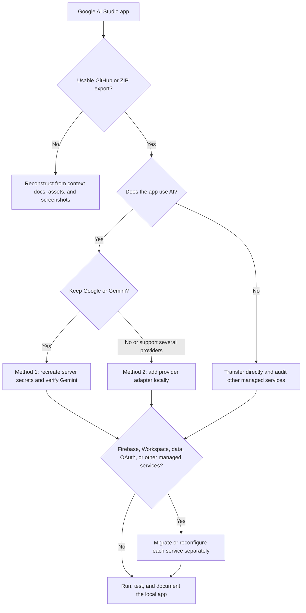

You can continue a Google AI Studio web app in Cursor, Claude Code, Codex CLI, or another coding environment. The right handoff method depends primarily on whether the app uses Gemini, another Google-managed integration, or no platform-specific services.

## Top-level map of methods and alternatives

| Situation                                                                  | Primary method                                                                                  | Alternative or fallback                                                             | What must be recreated outside AI Studio                                      |
| -------------------------------------------------------------------------- | ----------------------------------------------------------------------------------------------- | ----------------------------------------------------------------------------------- | ----------------------------------------------------------------------------- |
| App uses Gemini and should keep using it                                   | **Method 1:** Transfer the repository and supply `GEMINI_API_KEY` in the new server environment | Deploy to Cloud Run from AI Studio if local hosting is unnecessary                  | API key, server environment, dependencies, and any other managed services     |
| App uses Gemini but should support other providers                         | **Method 2:** Transfer first, then add a provider adapter locally                               | Keep the Gemini adapter as the initial default while adding providers incrementally | Provider keys, capability mappings, server boundary, and tests                |
| App already calls a third-party AI provider                                | Transfer the repository and recreate that provider's server-side secrets                        | Refactor it behind the same provider-adapter pattern                                | Third-party keys, OAuth, webhooks, and provider configuration                 |
| App does not use AI                                                        | Transfer through GitHub or ZIP and continue locally                                             | Recreate only if the exported project is unusable                                   | Non-AI secrets, data, authentication, storage, and hosted integrations        |
| App uses Firebase, Google Workspace, or another managed Google integration | Transfer the code, then audit that integration separately                                       | Keep hosting on Google while migrating the rest of the app                          | Data, OAuth/authorization, service configuration, and possibly infrastructure |
| GitHub/ZIP export cannot be made usable                                    | **Fallback:** Reconstruct from exhaustive documentation, assets, and screenshots in `context/`  | Rebuild only the essential flows first                                              | Any behavior or data not captured by the reconstruction package               |

The source-code transfer has two direct export routes plus a reconstruction fallback:

| Transfer route | Use when | Important limitation |
| --- | --- | --- |
| **GitHub two-way sync** | You want version history and may continue moving changes between AI Studio and a local IDE | Secrets and hosted service state are external configuration; verify them separately |
| **ZIP download** | You want a one-time local snapshot or cannot use GitHub | For a Gemini web app, the external runtime must supply `GEMINI_API_KEY` |
| **Documentation-and-screenshot reconstruction** | Neither source export produces a working or maintainable project | This is not lossless; hidden behavior must be rediscovered |



## Before exporting

Ask Google AI Studio to inspect and document the project before leaving the platform:

```text
Prepare this project for development outside Google AI Studio.

Document:
- the technology stack and exact run/build/test commands
- the client and server entry points
- every environment variable or managed secret the app expects, naming each variable but never printing its secret value
- every Gemini, Google AI, Firebase, Google Workspace, or other managed-platform integration
- which calls run on the server and which run in the browser
- the current model names, API endpoints, request shapes, response shapes, and error handling
- any Google AI Studio behavior that will not automatically transfer through GitHub or a ZIP download

Write the result to context/google-ai-studio-export.md. Do not expose, hardcode, or commit secret values.
```

Commit or export that documentation with the codebase.

## Export the code

For a Google AI Studio web app, use one of these routes:

- Link the app to a GitHub repository in AI Studio Settings, push the current project, and clone or pull that repository on the local computer.
- Download the project as a ZIP, extract it locally, and open the project folder in Cursor or another IDE/CLI.

Google AI Studio supports two-way GitHub sync for web apps: changes can be pushed from AI Studio and local changes can later be pulled back into it. Resolve and review conflicts instead of blindly selecting one side.

> [!note] Android projects
> Google AI Studio's native Android builder has different export limitations. As of 2026, its documented handoff is ZIP download rather than GitHub export.

## Method 1 — Keep Gemini or Google AI

Use this method when the app's AI features—such as generation, analysis, or image-related workflows—should continue using Gemini or another Google service.

### How the API key works in Google AI Studio in 2026

For current AI Studio web apps using the Gemini API, AI Studio automatically provides `GEMINI_API_KEY` as a **server-side secret**. It is managed through **Settings → Secrets** and injected into the server-side runtime. It is not supposed to be placed in browser code.

That is why the repository may not contain a `.env` file even though the code reads an environment variable. The value exists in AI Studio's hosted environment rather than in the source tree.

The secret is not application source code and should not be committed to GitHub. Google explicitly requires you to supply `GEMINI_API_KEY` in the external hosting environment for a ZIP export. For a GitHub-linked project, likewise treat AI Studio Secrets as external configuration: after cloning, inspect the code, configure the required variables locally, and verify them instead of assuming a secret was transferred with the repository.

### `GEMINI_API_KEY` versus `GOOGLE_API_KEY`

Google's Gemini API libraries can recognize either:

```text
GEMINI_API_KEY
GOOGLE_API_KEY
```

If both exist, Google's current documentation says `GOOGLE_API_KEY` takes precedence. However, AI Studio Build specifically documents its managed secret and external ZIP setup as `GEMINI_API_KEY`. Unless the exported source clearly expects something else, use `GEMINI_API_KEY` for the closest match to the AI Studio environment.

### Do not make the app display the API key

Do **not** add a page, debug component, API route, log statement, or browser response that prints the value of `GEMINI_API_KEY` or `GOOGLE_API_KEY`. A secret injected into a server environment is protected only while it stays server-side.

It is safe for the application to expose a boolean health result such as:

```json
{
  "geminiConfigured": true
}
```

It is not safe to expose:

```json
{
  "geminiApiKey": "actual-secret-value"
}
```

If you need to retrieve or manage the actual key while still in AI Studio, use its Secrets panel. Outside AI Studio, create or manage a key through the applicable Google account/project tooling. Do not ask the generated application to reveal it.

### Set up the local environment

First inspect the exported code and package scripts. The exact filename depends on the framework and server runtime, but a common local setup is:

```dotenv
GEMINI_API_KEY=replace-with-your-local-development-key
```

Save it in the environment file expected by the project, often `.env` or `.env.local`, or export it through the shell/hosting environment. Ensure that secret-bearing environment files are ignored by Git:

```gitignore
.env
.env.*
!.env.example
```

Commit a safe template instead:

```dotenv
# .env.example
GEMINI_API_KEY=
```

Never use a client-exposed variable prefix for a private Gemini key. Keep Gemini calls in server-side code, and have the browser call your server endpoint.

### Prompt for Cursor, Claude Code, or Codex CLI

```text
This app was exported from Google AI Studio and should continue using Gemini.

Read context/google-ai-studio-export.md and inspect the actual code. Identify every environment variable and every Gemini call. Preserve server-side secret handling and never expose an API key to browser code, client bundles, logs, API responses, or committed files.

Create a safe .env.example containing variable names only. Tell me which local environment file this framework expects and ensure secret-bearing files are gitignored. Use GEMINI_API_KEY unless the existing implementation or official SDK configuration clearly requires another name.

Install dependencies, run the app, and verify the Gemini integration through its server-side boundary. Report any AI Studio-managed service that cannot run locally without additional setup.
```

## Method 2 — Replace Gemini with a provider adapter

Use this method after cloning or downloading the app locally when you do not want the application tied directly to Google or Gemini.

Do the conversion in Cursor, Claude Code, Codex CLI, or another local coding agent that can inspect the complete repository and run its tests.

Introduce an adapter or provider interface between the application and the AI SDK:

```text
Application feature
        ↓
AI service interface
        ↓
Provider adapter
   ├── Gemini adapter
   ├── OpenAI adapter
   └── Anthropic adapter
```

The application should call a stable internal interface instead of importing a provider SDK directly throughout the UI and business logic. Configuration can then select the provider:

```dotenv
AI_PROVIDER=gemini
GEMINI_API_KEY=
OPENAI_API_KEY=
ANTHROPIC_API_KEY=
```

Only configure the key for the selected provider. Keep all provider credentials server-side.

Provider capabilities are not automatically equivalent. Text generation, structured output, image input, image generation, tool calling, streaming, and safety settings can differ. If the original app generates images, choose a replacement provider and model that actually supports image generation; do not assume every Claude, ChatGPT/OpenAI, or Gemini model supports the same operation.

### Provider-adapter prompt

```text
This application was exported from Google AI Studio. Remove direct Gemini coupling by introducing an adapter pattern that allows the AI provider to be selected through server-side configuration.

First document every current AI capability and its request/response contract. Then create a provider-neutral internal interface and adapters for the providers that can genuinely support those capabilities. Include Gemini, OpenAI, and Anthropic where technically applicable; explicitly report capability gaps instead of faking parity.

Requirements:
- Preserve existing user-visible behavior where the selected provider supports it.
- Keep provider SDK imports inside their adapters.
- Keep all API keys server-side.
- Select the provider with AI_PROVIDER.
- Validate required environment variables at startup without printing their values.
- Add .env.example with names and safe comments only.
- Add tests using mocked provider responses so normal tests do not spend API credits.
- Document provider selection, supported capabilities, and local setup.

Do not remove the working Gemini implementation until the adapter version is verified.
```

## If the app does not use AI

If the application has no Gemini calls, Google-managed AI integrations, or other platform-only dependencies, simply sync it to GitHub or download the ZIP, open it locally, install its dependencies, and run its documented commands.

Still inspect for non-AI platform dependencies such as Firebase, Google Workspace integrations, authentication, databases, storage, or AI Studio server features. Source-code transfer does not automatically transfer hosted data, OAuth configuration, secrets, or managed infrastructure.

Use this receiving-agent prompt:

```text
This project was exported from Google AI Studio but is not expected to use AI.

Inspect the repository for Google AI Studio-specific dependencies, managed services, missing environment variables, and assumptions about its hosted runtime. Create .env.example if configuration is required, without adding secret values. Install dependencies, run the app and tests, and document anything that must be recreated locally.
```

## Fallback — Recreate the app from documentation and screenshots

If GitHub sync, ZIP export, dependency recovery, or local execution does not produce a usable project, use Google AI Studio as the source for a reconstruction package.

Ask it to be exhaustive:

```text
Create an exhaustive reconstruction package for this website or web app so another coding agent can rebuild it without access to this Google AI Studio project.

Place the documentation under context/ and include:
- product purpose and target users
- complete technology stack
- architecture and relevant file tree
- route and page inventory
- detailed user flows, including alternate and error paths
- every component and interaction
- responsive behavior for desktop, tablet, and mobile
- design tokens: colors, typography, spacing, radii, shadows, and breakpoints
- style guide and reusable component rules
- forms, validation, empty states, loading states, and error states
- data models, sample data, storage, APIs, and authentication
- AI features and their exact inputs and outputs
- external assets, fonts, icons, image URLs, and licenses when known
- build, run, test, and deployment instructions
- known bugs, limitations, unfinished features, and deliberate design decisions

Never include secret values. Name required environment variables and explain their purpose.
```

Manually capture screenshots of as many pages and states as possible:

- desktop, tablet, and mobile layouts
- menus, dialogs, drawers, and expanded controls
- logged-in and logged-out states
- populated, empty, loading, validation, and error states
- hover, focus, selected, disabled, and success states when relevant

Organize everything before transferring it:

```text
context/
├── README.md
├── tech-stack.md
├── architecture.md
├── style-guide.md
├── user-flows.md
├── data-and-apis.md
├── assets/
└── screenshots/
    ├── desktop/
    ├── tablet/
    └── mobile/
```

Then place `context/` in the new local project and prompt Cursor or another agent:

```text
Recreate this website or web application using the supporting documentation, assets, and screenshots in context/.

Begin by inventorying the evidence and identifying contradictions or missing information. Write an implementation plan that maps each documented page, state, workflow, and responsive layout to code. Then implement in verifiable milestones.

Treat screenshots as visual evidence and the written user flows as behavioral requirements. Do not invent major features to fill gaps. Record necessary assumptions in context/reconstruction-assumptions.md. Add visual and functional tests for the documented flows and compare the implementation against the supplied screenshots at matching viewport sizes.
```

This fallback is a reconstruction, not a lossless export. Some hidden business logic, data, animation timing, accessibility behavior, or integration details may still need to be rediscovered and verified.

## Recommended handoff package

Whether preserving or replacing Gemini, transfer these together:

```text
AGENTS.md
MEMORY.md
AGENTS_CODE_REFERENCE.md
context/
├── google-ai-studio-export.md
├── chats/
├── screenshots/
└── supporting documentation
```

The repository carries the implementation, `AGENTS.md` carries working instructions, the code reference carries architectural orientation, `MEMORY.md` points to durable history, and `context/` preserves evidence from the former platform.

## Official references

Accuracy checked against the official documentation on 2026-10-08. Platform behavior can change, so recheck these sources before a future migration.

- [Build apps in Google AI Studio](https://ai.google.dev/gemini-api/docs/aistudio-build-mode)
- [Develop full-stack apps in Google AI Studio](https://ai.google.dev/gemini-api/docs/aistudio-fullstack)
- [Using Gemini API keys](https://ai.google.dev/gemini-api/docs/api-key)
- [Build Android apps in Google AI Studio](https://ai.google.dev/gemini-api/docs/aistudio-android)
