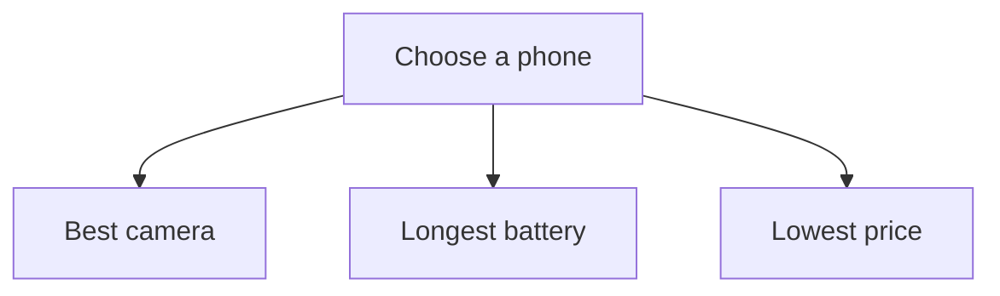

**“Builds connected, multi-path reasoning networks”** means the AI represents a problem as:

- **Nodes:** ideas, facts, possibilities, or steps
    
- **Connections:** relationships between those nodes
    
- **Multiple paths:** different routes toward an answer
    

For example, when choosing a phone:



**“Builds connected, multi-path reasoning networks”** means the AI represents a problem like a map:

- **Nodes** = facts, ideas, options, or possible conclusions
    
- **Connections/edges** = relationships between them
    
- **Multiple paths** = different routes the AI can explore toward an answer
    

For example:

```text
Problem: Website traffic dropped

Possible causes:
Algorithm update → ranking loss
Broken pages → indexing loss
Seasonal demand → fewer searches
Competitor growth → lower market share
```

The AI can explore each path, compare evidence, discard weak explanations, and combine strong ones.

Simpler wording:

> **Graph prompting: Organizes ideas and relationships into connected paths the AI can explore, compare, and combine.**